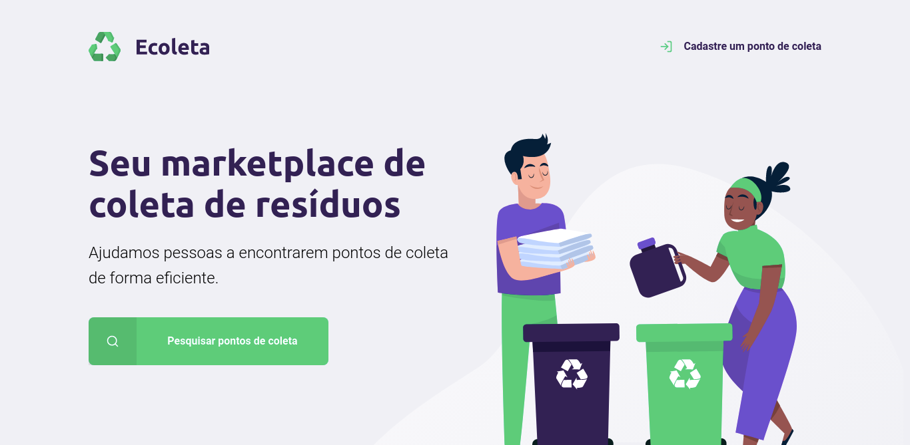
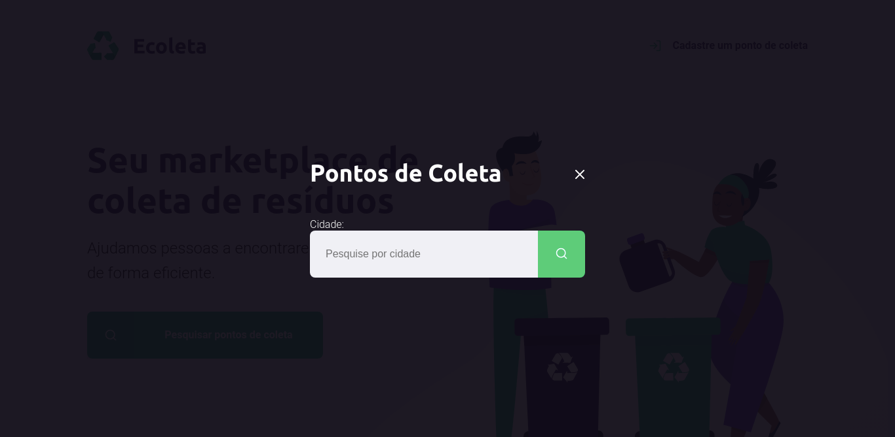
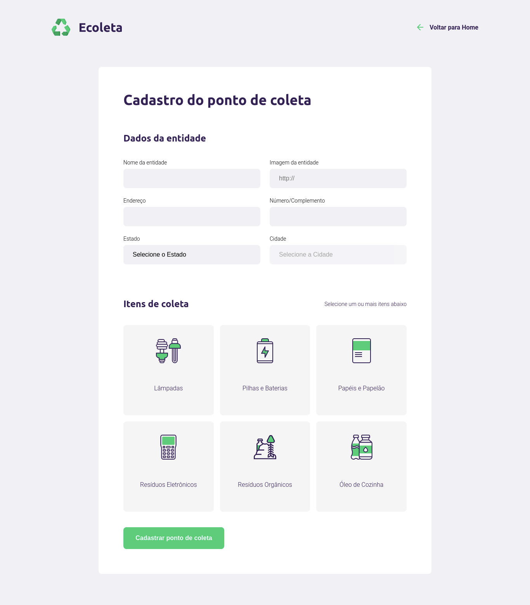
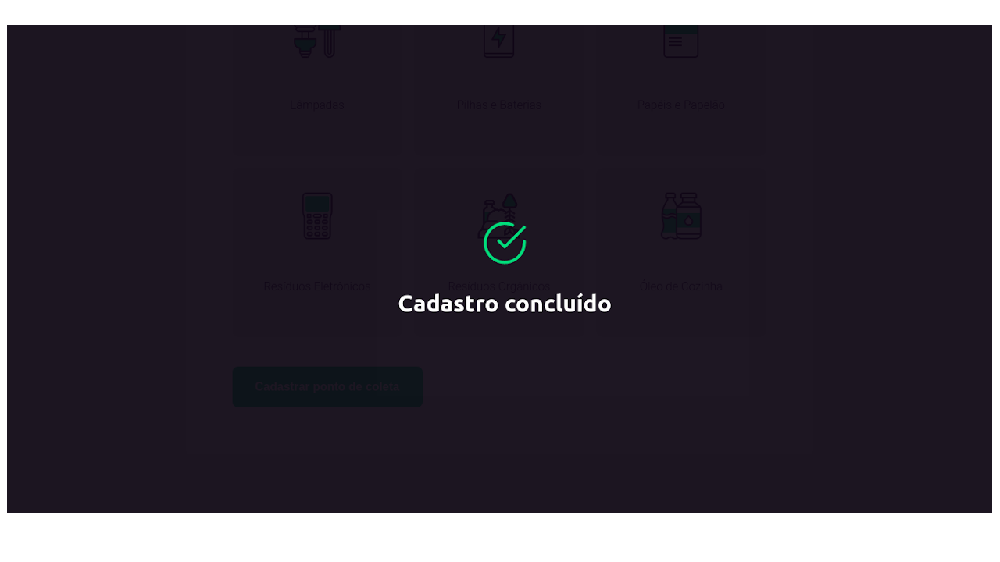
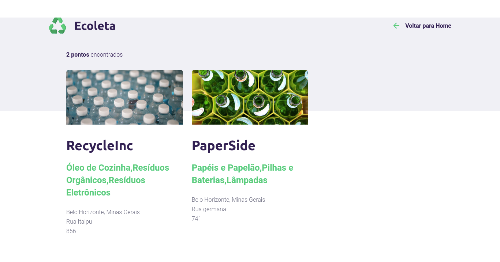

<h3 align="center">
    
      
    <b>Ajude o meio ambiente, fazemos parte dele ♻️</b> 
</h3>

## :bookmark: Sobre o desenvolvedor
<h4 align="left">
    Feito por <a href="https://www.linkedin.com/in/juanpablodev/" target="_blank">Juan Pablo</a>
</h4>

## :bookmark: Sobre o projeto

O <strong>Ecoleta</strong> é uma aplicação Web para ajudar pessoas a encontrarem pontos de coleta para reciclagem.

## 🚀 Tecnologias usadas

Este projeto foi desenvolvido com as seguintes tecnologias:

- [Javascript](https://developer.mozilla.org/en-US/docs/Web/JavaScript)
- [Node.Js](https://nodejs.org/en/)
- [HTML](https://developer.mozilla.org/en-US/docs/Web/HTML)
- [CSS](https://developer.mozilla.org/en-US/docs/Web/CSS)
- [SQLite](https://www.sqlite.org/index.html)

## :mortar_board: Quem ministrou?

As aulas foram ministradas pelo **<a href="https://github.com/maykbrito">Maiky Brito</a>**

## :memo: License

Esse projeto está sob a licença MIT. Veja o arquivo [LICENSE](LICENSE.md) para mais detalhes.

---

<h4 align="center">
    Feito por <a href="https://www.linkedin.com/in/juanpablodev/" target="_blank">Juan Pablo</a>
</h4>

📌 Sobre o Ecoleta - Seu marketplace de coleta de resíduos.

   

